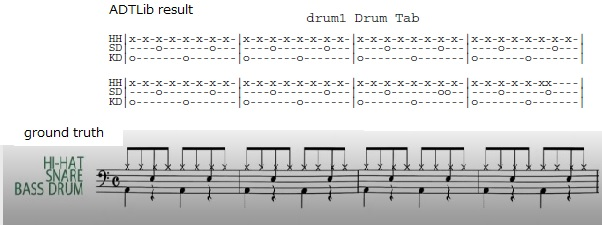
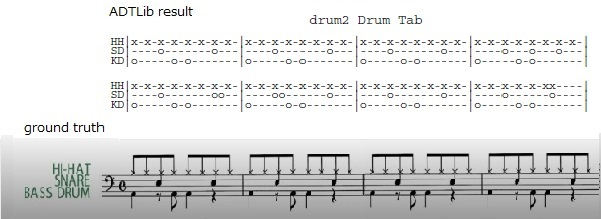
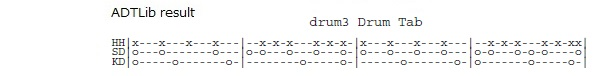

# A trial to Automatic Drum Transcription Library

This is a trial to Automatic Drum Transcription Library [ADTLib](https://github.com/CarlSouthall/ADTLib) on google coloaboratory using  tf1.5.x cpu and python3.6.x.  

## notebook
ADT_trial_colab_notebook.ipynb is [google coloaboratory notebook](https://colab.research.google.com/github.com/shun60s/ADTLib-trial/blob/master/ADT_trial_colab_notebook.ipynb) and ADT_trial_colab_notebook_with_full_output.ipynb is [notebook with full output](https://colab.research.google.com/github.com/shun60s/ADTLib-trial/blob/master/ADT_trial_colab_notebook_with_full_output.ipynb)  

## Automatic Drum Transcription (ADT) result 
drum1.wav and drum2.wav are basic 8 beat drum pattern. ADT result is not perfect.  
  
  

drum3.wav is samba drum pattern. ADT result is not good.  
  

